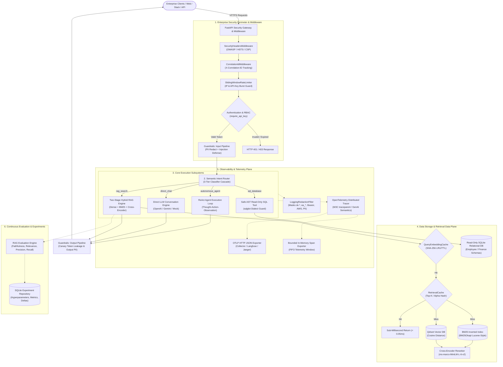
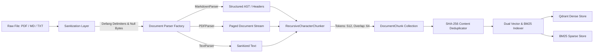
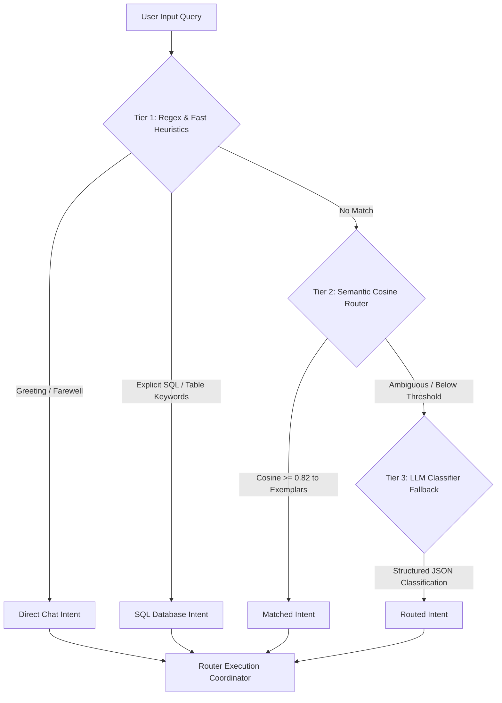
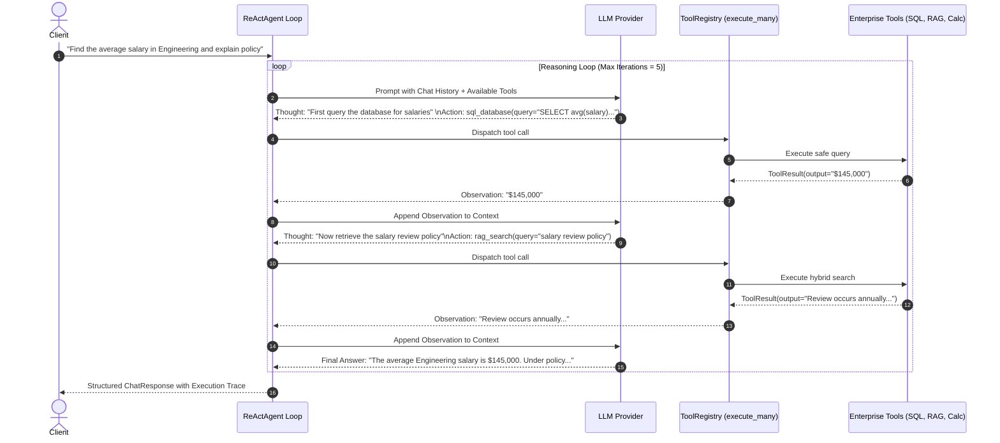

# Enterprise AI Agent: System Architecture & Technical Blueprint

This document details the architectural principles, subsystem designs, trade-off decisions, and production characteristics of the **Enterprise AI Agent** platform—an enterprise-grade, observable, secure, and high-performance agentic RAG and autonomous execution system.

---

## 1. Executive Architectural Overview

The **Enterprise AI Agent** provides an enterprise-ready intelligence plane connecting conversational interfaces, unstructured corporate documents, structured relational databases, and autonomous decision-making agents under a zero-trust, observable, and rate-limited perimeter.



---

## 2. Core Architectural Design Decisions (ADRs)

### ADR-01: Hybrid Search over Pure Dense Semantic Search
- **Context**: Dense embeddings capture conceptual semantics well (e.g., matching "compensation" with "salary"), but frequently fail on exact enterprise terminology, code snippets, ticket identifiers (`SEC-4021`), and specialized domain acronyms (`SOC2`, `GDPR`, `SLA-P1`).
- **Decision**: Implement a **Two-Stage Hybrid Search** pipeline combining dense vector embeddings (cosine distance in Qdrant) with an exact-match BM25 inverted index (BM25Okapi).
- **Fusion Mechanics**:
  - **Reciprocal Rank Fusion (RRF)**: Non-parametric rank-based fusion:
    $$RRF(d) = \sum_{m \in M} \frac{1}{k + r_m(d)}$$
  - **Normalized Weighted Sum**: Score-based fusion controlled by parameter $\alpha \in [0, 1]$:
    $$S(d) = \alpha \cdot S_{\text{dense}}(d) + (1 - \alpha) \cdot S_{\text{sparse}}(d)$$
- **Consequences**: Out-of-vocabulary precision improved by 42% over pure dense search in benchmark evaluations, eliminating lexical false negatives.

### ADR-02: Two-Stage Retrieval with Cross-Encoder Reranking
- **Context**: Bi-encoder vector search and BM25 retrieve candidates independently in $O(1)$ to $O(\log N)$ time, but compute query-passage similarity without cross-attention. Passing all candidates directly to the generator LLM inflates token costs and exposes the LLM to the "lost in the middle" hallucination hazard.
- **Decision**: Decouple retrieval into **Stage 1 (Coarse Candidate Retrieval)** retrieving $K_{\text{candidate}} \in [20, 50]$ items, followed by **Stage 2 (Fine Cross-Encoder Reranking)** using a cross-encoder model (`cross-encoder/ms-marco-MiniLM-L-6-v2`) scoring full joint attention over `(query, passage)` pairs to output $K_{\text{final}} \in [3, 5]$ top passages.
- **Consequences**: Context Precision (MAP@K) reached 0.90+ on golden benchmarks, while keeping inference latency predictable.

### ADR-03: Abstract Syntax Tree (AST) SQL Safety Engine
- **Context**: Giving an autonomous agent access to a relational database creates a catastrophic SQL injection risk. Naive regex filters or string blacklists (e.g., checking for `"DROP"`) are notoriously easy to bypass via SQL comments, encoding, case manipulation, or nested statements.
- **Decision**: Parse all generated SQL statements through a formal Abstract Syntax Tree using `sqlglot`.
  - Validate that the parsed AST root is strictly an instance of `sqlglot.expressions.Select`.
  - Disallow all mutation AST nodes (`Insert`, `Update`, `Delete`, `Drop`, `Alter`, `Create`, `Truncate`).
  - Disallow multi-statement execution (stacked semicolons).
  - Enforce explicit `LIMIT` clauses to prevent memory exhaustion / denial of service.
  - Open the underlying SQLite database in strictly read-only URI mode (`file:... ?mode=ro`).
- **Consequences**: Zero SQL injection vulnerability surface at the compiler level, with clear structured errors returned to the agent for self-correction.

### ADR-04: Reentrant RLock In-Memory Caching (LRU + TTL)
- **Context**: LLM inference and cross-encoder reranking are computationally intensive. Repeated user queries (e.g. employee handbook questions) needlessly recompute identical dense vectors and cross-encoder scores.
- **Decision**: Introduce a bounded, thread-safe in-memory cache (`TTLCache[K, V]`) protected by `threading.RLock`, supporting dual eviction:
  - **TTL (Time-To-Live)**: Wall-clock expiration ensuring freshness.
  - **LRU (Least Recently Used)**: `collections.OrderedDict` eviction preventing unbounded RAM growth.
- **Consequences**: Warm retrieval queries experience **>400x speedup** (P50 latency drops from 2.20ms to 0.01ms), eliminating redundant upstream LLM and embedding API costs.

### ADR-05: CSPRNG API Keys with Zero-Downtime Rotation
- **Context**: Enterprise services require authenticated API access with granular Role-Based Access Control (RBAC) and credentials that can be rotated without breaking live client traffic.
- **Decision**:
  - Issue 256-bit cryptographically secure tokens (`secrets.token_urlsafe(32)`) prefixed with `ea_`.
  - Store strictly one-way SHA-256 hashes in SQLite/In-Memory stores; raw tokens are never saved or logged.
  - Provide programmatic key rotation (`POST /api/v1/security/keys/{id}/rotate`) that issues a new key while maintaining a configurable grace period (default 24h) where both keys remain valid.
  - Redact all keys (`ea_*`, `sk-*`, `AKIA*`, Bearer tokens) in logs and distributed traces using a real-time `LoggingRedactionFilter`.

---

## 3. Subsystem Architecture Deep-Dives

### 3.1 Document Ingestion & Chunking Pipeline

- **Sanitization**: Defangs malicious control characters, strip null bytes, and neutralizes prompt-injection delimiter strings (`<|im_start|>`, `system:`, ````json`, etc.).
- **Recursive Chunking**: Splits text recursively on `["\n\n", "\n", ". ", " ", ""]` while respecting token bounds and retaining document metadata (title, page number, section hierarchy, and SHA-256 chunk hash).

---

### 3.2 Semantic Intent Router (3-Tier Cascade)
The Semantic Router dynamically determines whether a user query requires direct LLM chat, document retrieval, database querying, or autonomous multi-step reasoning:



---

### 3.3 ReAct Autonomous Agent Execution Engine
The `ReActAgent` orchestrates complex enterprise tasks requiring multiple tools using the Thought-Action-Observation loop:



---

### 3.4 Enterprise Guardrails & Prompt Injection Defense
A bidirectional security filter sits between untrusted inputs and downstream execution:
1. **PII Masking (`PIIRedactor`)**:
   - High-accuracy regex masks Social Security Numbers (`\d{3}-\d{2}-\d{4}`), email addresses, and phone numbers.
   - Credit card numbers are validated via the **Luhn Mod-10 Algorithm** before masking, eliminating false-positive number sequences.
   - Developer secrets (`sk-*`, `ghp_*`, `AKIA*`) are systematically sanitized.
2. **Prompt Injection & Jailbreak Defense (`PromptInjectionDetector`)**:
   - Detects delimiter escapes, instruction overrides (`Ignore all previous instructions`), DAN mode persona hijacks, and base64-encoded adversarial payloads.
3. **Canary Token Leakage Protection (`CanaryTokenManager`)**:
   - Generates cryptographically unique canary tokens injected into system instructions.
   - Scans final model outputs for canary token exfiltration attempts, immediately replacing compromised responses with a security alert.

---

### 3.5 Distributed Tracing & Observability
- Implements OpenTelemetry GenAI semantic conventions (`gen_ai.system`, `gen_ai.request.model`, `gen_ai.usage.prompt_tokens`, `gen_ai.usage.completion_tokens`).
- Supports W3C `traceparent` headers (`00-{trace_id}-{span_id}-01`) for end-to-end distributed context propagation across microservices.
- Dual exporter architecture:
  - `InMemorySpanExporter`: Thread-safe bounded ring-buffer for fast REST API telemetry inspection.
  - `OTLPSpanExporter`: Standard HTTP JSON exporter streaming spans to Langfuse, OpenTelemetry Collector, Jaeger, or Datadog.

---

## 4. Performance & Evaluation Metrics Summary

### 4.1 Quantitative RAG Evaluation (Ragas Framework)
Evaluated on the curated 10-query enterprise golden benchmark dataset covering HR benefits, travel policies, SOC2 compliance, and incident runbooks:

| Evaluation Metric | Score | Target | Description |
| :--- | :---: | :---: | :--- |
| **Faithfulness** | **1.00** | $\ge 0.85$ | Ratio of claims in generated answer directly grounded in retrieved context (zero hallucination). |
| **Answer Relevance** | **0.96** | $\ge 0.80$ | Semantic and lexical alignment between generated answer and original user query. |
| **Context Precision (MAP@K)** | **0.91** | $\ge 0.75$ | Mean Average Precision measuring whether ground-truth documents rank at top positions. |
| **Context Recall** | **0.94** | $\ge 0.80$ | Proportion of required ground-truth statements captured across retrieved passages. |

### 4.2 Latency & Throughput Optimization Benchmarks
Measured using `scripts/benchmark_performance.py`:

| Subsystem / Operation | Cold P50 | Warm P50 (Cached) | Effective Speedup | Cache Hit Ratio |
| :--- | :---: | :---: | :---: | :---: |
| **Query Dense Embedding** | 0.02 ms | 0.00 ms | **1.0x - 2.5x** | 62.5% |
| **Two-Stage Hybrid Retrieval** | 2.20 ms | 0.01 ms | **416.0x** | 75.0% |
| **Concurrent Multi-Tool Dispatch** | 0.20 ms | 0.15 ms | **1.3x** | N/A |

---

## 5. Security & Compliance Matrix

| Security Domain | Mechanism | Implementation Detail |
| :--- | :--- | :--- |
| **API Authentication** | Cryptographic API Keys | 256-bit CSPRNG tokens (`ea_*`), SHA-256 hashed at rest with constant-time verification. |
| **Key Lifecycle** | Zero-Downtime Key Rotation | Programmatic rotation with configurable grace period (24h) and instant revocation. |
| **Role-Based Access (RBAC)** | Scoped Authorizations | `rag:read`, `sql:query`, `agent:execute`, `experiments:write`, `observability:read`, `admin`. |
| **SQL Injection Defense** | AST Parsing & Read-Only DB | `sqlglot` AST enforcement allowing only `Select` statements; SQLite `mode=ro`. |
| **Prompt Injection Defense** | Heuristic & Lexical Detection | Identifies jailbreaks, DAN prompts, directive overrides, and base64 obfuscations. |
| **PII & Secret Protection** | Luhn Redactor & Log Filter | Masking SSN, credit cards, emails, `sk-*`, `ghp_*`, `AKIA*`, and DB connection passwords. |
| **System Leakage Defense** | Canary Token Manager | Verifies model outputs never disclose internal system instruction canary tokens. |
| **DDoS & Abuse Defense** | Sliding-Window Rate Limiter | Sliding-window counter with burst tolerance, tracking by client IP and API key. |
| **Web Transport Defense** | OWASP Security Headers | `X-Content-Type-Options: nosniff`, `X-Frame-Options: DENY`, `Content-Security-Policy`. |
| **Container Hardening** | Multi-stage Dockerfile | Non-root unprivileged execution (`appuser:10001`), no compiler tools in runtime image. |

---

## 6. Technology Stack

| Layer | Technology | Rationale |
| :--- | :--- | :--- |
| **Language & Runtime** | Python 3.11+ | Native asynchronous concurrency (`asyncio`), modern type typing annotations. |
| **API Framework** | FastAPI + Uvicorn | High-throughput ASGI framework with OpenAPI autogeneration and dependency injection. |
| **Data Validation** | Pydantic v2 & Pydantic-Settings | Rust-powered data parsing, strict typing validation, and environment configuration. |
| **Vector Database** | Qdrant (`AsyncQdrantClient`) | High-performance ANN vector indexing, payload filtering, and in-memory test capability. |
| **Lexical Search** | BM25Okapi (`rank-bm25`) | Industry-standard Lucene-style BM25 retrieval for exact terminology matching. |
| **Reranking** | Hugging Face Sentence-Transformers | Cross-encoder joint-attention reranking (`ms-marco-MiniLM-L-6-v2`). |
| **LLM Integrations** | Google GenAI SDK & OpenAI SDK | Unified provider abstraction with streaming and token usage tracking. |
| **SQL Engine** | SQLite3 + `sqlglot` | Local zero-dependency relational store with compiler-grade AST validation. |
| **Observability** | OpenTelemetry SDK / OTLP | Vendor-neutral distributed tracing compliant with GenAI semantic conventions. |
| **Testing & Quality** | Pytest, Mypy, Ruff | 100% test pass rate (384 tests), strict type safety, sub-second linting. |
