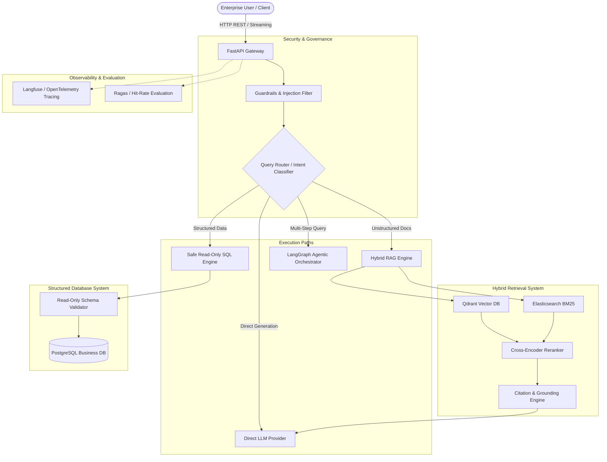

# Enterprise AI Knowledge & Decision Agent

[](https://www.python.org/downloads/)
[](https://fastapi.tiangolo.com)
[](https://github.com/astral-sh/ruff)
[](https://mypy-lang.org/)
[]()

> A production-oriented enterprise AI platform engineered to intelligently unify unstructured document knowledge retrieval, structured SQL business analytics, and agentic multi-tool reasoning behind a secure, observable API.

---

## 1. System Vision & Architecture

Standard enterprise RAG applications often fail because they treat every question as a vector similarity search problem. In real enterprise environments:
- **Policy & Procedure Questions** ("What is our refund policy?") require **Hybrid Retrieval** (dense vectors + sparse BM25) and **Reranking** with exact citation attribution.
- **Quantitative Business Questions** ("Which product had the highest complaints last month?") cannot be answered by cosine similarity on PDF chunks; they require **Safe, Deterministic SQL Generation** over structured data warehouses.
- **Complex Multi-Step Questions** ("Which product had the most complaints and what does our documentation say about its known defects?") require **Agentic Multi-Tool Reasoning** with state graphs.
- **Direct Queries** ("Summarize this text") require **Zero-Retrieval LLM Direct Generation** to save latency and vector database compute.

### Overall Target Architecture



---

## 2. Technology Stack & Rationale

| Component | Selected Technology | Why Chosen Over Alternatives |
| :--- | :--- | :--- |
| **Language & Runtime** | Python 3.11+ | Optimal balance of cutting-edge typing features and enterprise AI library support. |
| **API Framework** | FastAPI + Uvicorn | Native async I/O, auto-generated OpenAPI documentation, Pydantic v2 data validation, and first-class dependency injection. |
| **Configuration** | Pydantic Settings | 12-factor configuration; strictly typed, validated at startup, and secret-safe (`SecretStr`). |
| **LLM Gateway** | Custom Provider Abstraction | Avoids tight framework lock-in. Seamlessly switches between OpenAI, Groq, Ollama (local), vLLM, and a deterministic offline Mock provider. |
| **Vector Database** | Qdrant *(Phase 5)* | Rust-powered high-concurrency vector store with robust payload filtering and snapshot management. |
| **Keyword Search** | Elasticsearch *(Phase 8)* | Enterprise BM25 sparse search with proven reliability for exact keyword, SKU, and code matching. |
| **Code Quality** | Ruff + Mypy + Pytest | Sub-second linting, strict static typing, and high-coverage automated unit/integration test suites. |

---

## 3. Project Structure

```text
d:/PROJECT/Enterprise AI Agent/
├── .env.example                     # Reference environment variables
├── .env                             # Local configuration (defaults to mock mode)
├── .gitignore                       # Git ignore rules
├── pyproject.toml                   # Project metadata, dependencies, Ruff & Mypy configs
├── requirements.txt                 # Production dependencies
├── requirements-dev.txt             # Development and test dependencies
├── README.md                        # Documentation and architecture guide
├── src/
│   └── enterprise_agent/
│       ├── __init__.py
│       ├── config/                  # 12-factor configuration
│       │   ├── __init__.py
│       │   └── settings.py          # Pydantic Settings model
│       ├── core/                    # Core foundation
│       │   ├── __init__.py
│       │   ├── exceptions.py        # Domain exception hierarchy
│       │   └── logging.py           # Structured logger configuration
│       ├── llm/                     # LLM Provider Abstraction
│       │   ├── __init__.py
│       │   ├── base.py              # LLMProvider interface & data contracts
│       │   ├── openai_client.py     # OpenAI-compatible asynchronous implementation
│       │   ├── mock_client.py       # Deterministic mock provider for tests & offline dev
│       │   └── factory.py           # Factory resolving provider via settings
│       ├── schemas/                 # Request & Response contracts
│       │   ├── __init__.py
│       │   └── chat.py              # ChatRequest, ChatResponse, TokenUsage
│       ├── api/                     # Presentation layer
│       │   ├── __init__.py
│       │   ├── deps.py              # Dependency injection providers
│       │   └── v1/
│       │       ├── __init__.py
│       │       ├── api.py           # v1 router aggregator
│       │       ├── health.py        # GET /api/v1/health & upstream probe
│       │       └── chat.py          # POST /api/v1/chat direct generation
│       └── main.py                  # FastAPI app factory, lifespan, & error handlers
└── tests/
    ├── __init__.py
    ├── conftest.py                  # Pytest fixtures and mock client setup
    ├── unit/
    │   ├── __init__.py
    │   ├── test_config.py           # Settings validation unit tests
    │   └── test_llm_service.py      # LLM abstraction & error mapping unit tests
    └── integration/
        ├── __init__.py
        └── test_chat_api.py         # FastAPI endpoints integration tests
```

---

## 4. Getting Started

### Prerequisites
- Python 3.11+
- Git

### 1. Setup Virtual Environment
```bash
# Windows
py -3.11 -m venv .venv
.venv\Scripts\activate

# Linux / macOS
python3.11 -m venv .venv
source .venv/bin/activate
```

### 2. Install Dependencies
```bash
pip install -r requirements-dev.txt
pip install -e .
```

### 3. Configure Environment
Copy `.env.example` to `.env`. By default, `LLM_PROVIDER="mock"` is enabled so you can run the entire system offline immediately without any API keys or billing.
```bash
cp .env.example .env
```

To switch to a live model (e.g. OpenAI or Groq), update `.env`:
```env
LLM_PROVIDER="openai"
LLM_MODEL="gpt-4o-mini"
LLM_API_KEY="sk-your-actual-api-key"
LLM_BASE_URL="https://api.openai.com/v1"
```

### 4. Run the API Server
```bash
# Using uvicorn
uvicorn enterprise_agent.main:app --host 0.0.0.0 --port 8000 --reload
```

Interactive OpenAPI documentation is available at:
- **Swagger UI**: [http://localhost:8000/docs](http://localhost:8000/docs)
- **ReDoc**: [http://localhost:8000/redoc](http://localhost:8000/redoc)

---

## 5. API Verification & Usage

### Check Health Status
```bash
curl -X GET http://localhost:8000/api/v1/health
```
**Response:**
```json
{
  "status": "healthy",
  "app_name": "Enterprise AI Knowledge & Decision Agent",
  "version": "0.1.0",
  "environment": "development",
  "llm_healthy": true
}
```

### Submit Chat Query (`/api/v1/chat`)
```bash
curl -X POST http://localhost:8000/api/v1/chat \
  -H "Content-Type: application/json" \
  -d '{
    "query": "What is our company vacation policy?",
    "system_prompt": "You are a professional HR assistant.",
    "temperature": 0.2
  }'
```
**Response:**
```json
{
  "answer": "[MOCK RESPONSE] Processed query: 'What is our company vacation policy?'. Result: This is a simulated response from the enterprise MockLLMProvider.",
  "model": "gpt-4o-mini",
  "usage": {
    "prompt_tokens": 12,
    "completion_tokens": 40,
    "total_tokens": 52
  },
  "latency_ms": 0.15,
  "status": "success"
}
```

---

## 6. Running Tests & Code Quality

The project enforces strict typing (`mypy`), modern linting (`ruff`), and automated testing (`pytest`).

```bash
# 1. Run unit and integration tests with coverage
pytest --cov=enterprise_agent tests/

# 2. Run Ruff linter and formatter checks
ruff check .
ruff format --check .

# 3. Run strict static type checking
mypy src tests
```

---

## 7. Roadmap & Milestones

- [x] **Milestone 1: Project Foundation & Core LLM Abstraction**
  - Clean architecture directory layout
  - 12-factor configuration via Pydantic Settings
  - Decoupled `LLMProvider` interface with OpenAI-compatible & Mock implementations
  - Base `/api/v1/chat` and `/api/v1/health` endpoints
  - High-coverage unit and integration test suite
- [ ] **Milestone 2: LLM Streaming & Service Enhancements**
- [ ] **Milestone 3: Enterprise Document Ingestion (PDF, Markdown, DOCX)**
- [ ] **Milestone 4: Embedding Service Abstraction**
- [ ] **Milestone 5: Qdrant Vector Store Integration**
- [ ] **Milestone 6: Baseline RAG Pipeline**
- [ ] **Milestone 7: Exact Document Citations & Grounding**
- [ ] **Milestone 8: Hybrid Search with Elasticsearch (BM25 + Dense)**
- [ ] **Milestone 9: Cross-Encoder Reranking**
- [ ] **Milestone 10: Query Transformation (HyDE, Multi-Query, Step-Back)**
- [ ] **Milestone 11: Tool-Augmented Agent Engine**
- [ ] **Milestone 12: Safe Read-Only SQL Database Tool**
- [ ] **Milestone 13: Semantic Query Router**
- [ ] **Milestone 14: Enterprise Guardrails & Prompt-Injection Defense**
- [ ] **Milestone 15: RAG Evaluation with Ragas & Custom Metrics**
- [ ] **Milestone 16: Experiment Tracking & Benchmarking**
- [ ] **Milestone 17: Observability (Langfuse / OpenTelemetry)**
- [ ] **Milestone 18: API Surface Polish & Rate Limiting**
- [ ] **Milestone 19: End-to-End Testing & Mock Fixtures**
- [ ] **Milestone 20: Docker & Docker Compose Infrastructure**
- [ ] **Milestone 21: Synthetic Enterprise Knowledge Base**
- [ ] **Milestone 22: Interactive Demonstration Scenarios**
- [ ] **Milestone 23: Security & Credential Hardening**
- [ ] **Milestone 24: Latency & Throughput Performance Optimization**
- [ ] **Milestone 25: Resume-Quality Documentation & Architecture Showcase**
