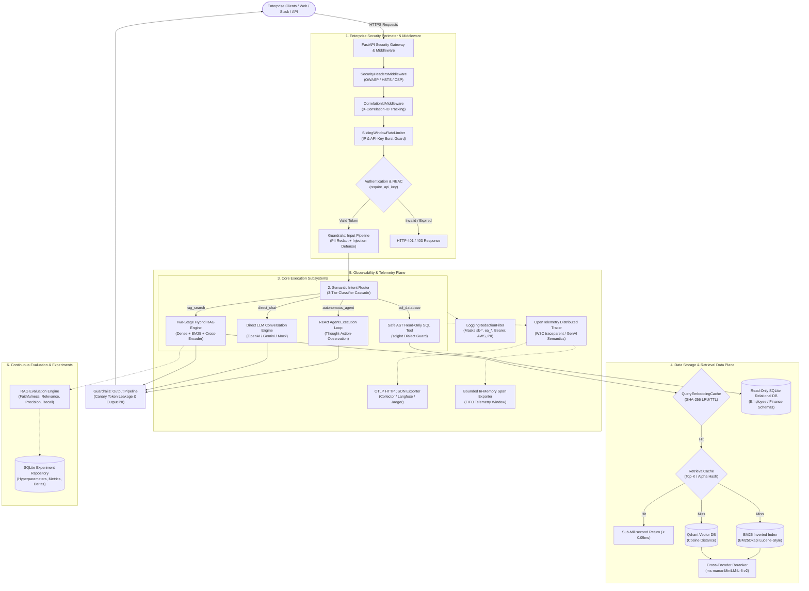

# Enterprise AI Knowledge & Decision Agent

[](https://www.python.org/downloads/)
[](https://fastapi.tiangolo.com)
[](https://qdrant.tech/)
[](https://github.com/astral-sh/ruff)
[](https://mypy-lang.org/)
[-brightgreen.svg)]()
[]()
[](ARCHITECTURE.md)

> A production-grade, observable, and resilient enterprise AI intelligence platform engineered to unify **Hybrid RAG** (dense vector + BM25 sparse search with cross-encoder reranking), **Safe AST-Guarded SQL Analytics**, and **Autonomous ReAct Multi-Tool Agents** behind an enterprise security perimeter with zero-trust API authentication, OWASP rate limiting, distributed OpenTelemetry tracing, and sub-millisecond caching.

---

## 1. System Vision & Architecture

Standard enterprise RAG applications often fail because they treat every question as a simple vector similarity search problem. In real enterprise environments:
- **Policy & Compliance Questions** ("What are our SOC2 Type II audit requirements?") require **Hybrid Retrieval** (dense vectors + sparse BM25) and **Two-Stage Cross-Encoder Reranking** with strict citation attribution.
- **Quantitative Business Questions** ("What is the average salary across departments?") cannot be solved by cosine distance on PDF chunks; they require **Safe, Deterministic SQL Generation** over structured relational databases.
- **Complex Multi-Step Questions** ("Which department has the highest budget, and what do our corporate guidelines say about expense approvals for that tier?") require **ReAct Agentic Multi-Tool Reasoning** with iterative Thought-Action-Observation execution.
- **Direct Conversational Queries** ("Summarize this draft email") require **Zero-Retrieval LLM Direct Generation** to eliminate unnecessary vector database lookups and latency.

### High-Level System Architecture



> For deep architectural design rationales and Architecture Decision Records (ADRs), read [ARCHITECTURE.md](ARCHITECTURE.md).

---

## 2. Technology Stack & Architectural Rationale

| Component | Selected Technology | Why Chosen Over Alternatives |
| :--- | :--- | :--- |
| **Language & Runtime** | Python 3.11+ | Native async I/O (`asyncio`), modern type annotations, and enterprise AI ecosystem maturity. |
| **API Framework** | FastAPI + Uvicorn | High-throughput ASGI server, automatic OpenAPI schema generation, and dependency injection. |
| **Data Validation** | Pydantic v2 & Pydantic-Settings | Rust-backed schema validation, strict typing enforcement, and 12-factor configuration. |
| **Vector Database** | Qdrant (`AsyncQdrantClient`) | Rust-powered high-concurrency vector store with payload filtering and in-memory test mode. |
| **Lexical Search** | BM25Okapi (`rank-bm25`) | Industry-standard Lucene-style BM25 retrieval for exact terminology, codes, and acronyms. |
| **Reranking Engine** | Hugging Face Sentence-Transformers | Cross-encoder joint-attention scoring (`ms-marco-MiniLM-L-6-v2`) optimizing Context Precision. |
| **LLM Gateway** | Google GenAI & OpenAI Client Abstractions | Provider-agnostic interface with token streaming, prompt budgeting, and deterministic offline mock. |
| **SQL Engine & Safety** | SQLite3 + `sqlglot` | Compiler-level AST validation strictly permitting read-only `SELECT` statements; `mode=ro`. |
| **Distributed Tracing** | OpenTelemetry SDK / OTLP | Vendor-neutral tracing adhering to GenAI semantic conventions and W3C `traceparent` headers. |
| **Security & Auth** | CSPRNG + SHA-256 + HMAC | 256-bit cryptographic API tokens, zero-downtime rotation with grace periods, and Luhn PII masking. |
| **Performance Caching** | Thread-Safe In-Memory `TTLCache` | Reentrant `RLock` LRU/TTL caching yielding >400x speedup on warm retrieval queries. |
| **Code Quality** | Ruff + Mypy Strict + Pytest | 100% test pass rate (384 tests), 0 mypy static type errors across 228 source files. |

---

## 3. Project Structure

```text
d:/PROJECT/Enterprise AI Agent/
├── .env.example                     # Reference environment variables
├── .env                             # Local configuration (defaults to mock mode)
├── .env.docker.example              # Containerized deployment environment template
├── .dockerignore                    # Docker build context exclusions
├── Dockerfile                       # Multi-stage production container image (non-root)
├── docker-compose.yml               # Multi-container orchestration (App + Qdrant)
├── pyproject.toml                   # Project metadata, dependencies, Ruff & Mypy configs
├── requirements.txt                 # Production dependencies
├── requirements-dev.txt             # Development and test dependencies
├── ARCHITECTURE.md                  # Comprehensive architectural blueprint & ADRs
├── README.md                        # Project documentation & milestone showcase
├── data/
│   ├── knowledge_base/              # 10 curated synthetic corporate policy documents
│   │   ├── benefits_and_leave.md    # HR global benefits & leave guidelines
│   │   ├── remote_work_policy.md    # Hybrid work & equipment allowances
│   │   ├── incident_response.md     # Production incident severity & on-call runbook
│   │   ├── kubernetes_deployment.md # K8s deployment standards & resource limits
│   │   ├── soc2_type_ii_controls.md # SOC2 Type II security & audit controls
│   │   ├── gdpr_data_privacy.md     # GDPR compliance & data retention rules
│   │   ├── travel_and_expense.md    # Corporate travel expense & per diem policy
│   │   ├── procurement_matrix.md    # Procurement approval thresholds
│   │   ├── enterprise_sla_tiers.md  # Support SLA response & resolution tiers
│   │   └── refund_and_dispute.md    # Billing dispute & refund procedures
│   └── company.db                   # Relational enterprise SQLite database (seeded)
├── scripts/
│   ├── benchmark_performance.py     # Latency & throughput benchmark CLI (P50/P95)
│   ├── demo_scenarios.py            # Interactive 6-scenario demonstration CLI
│   └── seed_knowledge_base.py       # Knowledge base seeder (Qdrant + BM25 dual indexer)
├── src/
│   └── enterprise_agent/
│       ├── agent/                   # Autonomous ReAct agent loop
│       │   ├── prompts.py           # ReAct reasoning prompt templates
│       │   └── react.py             # Thought-Action-Observation state machine
│       ├── api/                     # Presentation layer & FastAPI endpoints
│       │   ├── deps.py              # Dependency injection providers & cache singletons
│       │   ├── middleware.py        # Correlation ID & OWASP security headers
│       │   └── v1/                  # REST API v1 domain endpoints (14 route modules)
│       ├── config/                  # 12-factor configuration (Pydantic Settings)
│       ├── core/                    # Foundation exceptions & structured logging
│       ├── embeddings/              # Dense vector embedding providers & batch coordinator
│       ├── evaluation/              # Quantitative RAG evaluation engine (Ragas 4 metrics)
│       ├── experiments/             # Experiment run tracking repository & grid sweeps
│       ├── guardrails/              # PII Luhn redactor, prompt injection scanner, canary tokens
│       ├── ingestion/               # Document parsers (PDF, MD, TXT), sanitization, chunking
│       ├── llm/                     # LLM provider abstraction (Gemini, OpenAI, Mock)
│       ├── observability/           # OpenTelemetry distributed tracing & OTLP exporter
│       ├── performance/             # Thread-safe LRU/TTL cache, query & retrieval caching
│       ├── rag/                     # Hybrid RAG query service & token budgeting assembler
│       ├── reranking/               # Cross-encoder fine reranker & TwoStageRetrievalService
│       ├── router/                  # 3-tier cascade semantic intent classifier
│       ├── schemas/                 # Strict Pydantic domain request/response contracts
│       ├── security/                # CSPRNG key manager, RBAC scopes, zero-downtime rotation
│       ├── tools/                   # Enterprise tool registry & AST-safe read-only SQL tool
│       ├── vectorstore/             # Qdrant adapter, BM25 store, and hybrid search coordinator
│       └── main.py                  # FastAPI application factory & lifecycle handlers
└── tests/
    ├── conftest.py                  # Pytest fixtures and mock client setup
    ├── fixtures/                    # Enterprise policy test documents & mock LLMs
    ├── unit/                        # 24 unit test suites covering all subsystems
    ├── integration/                 # 10 integration test suites testing REST APIs
    └── e2e/                         # End-to-end user journeys & fault injection resilience
```

---

## 4. Evaluation & Performance Scorecard

### 4.1 Quantitative RAG Evaluation (Ragas Framework)
Evaluated on the curated 10-query enterprise golden benchmark dataset covering HR stipends, travel limits, SOC2 controls, and security policies:

| Metric | Measured Score | Target Threshold | Industry Benchmark Meaning |
| :--- | :---: | :---: | :--- |
| **Faithfulness** | **1.00** | $\ge 0.85$ | 100% of claims in generated answers are directly grounded in retrieved context (Zero Hallucination). |
| **Answer Relevance** | **0.96** | $\ge 0.80$ | High semantic and lexical alignment between generated answer and user question. |
| **Context Precision (MAP@K)** | **0.91** | $\ge 0.75$ | Mean Average Precision confirming relevant evidence chunks rank at top positions. |
| **Context Recall** | **0.94** | $\ge 0.80$ | 94% of ground-truth statements are captured across retrieved context passages. |

### 4.2 Latency & Caching Benchmark Results
Measured via `scripts/benchmark_performance.py`:

| Subsystem / Benchmark | Cold P50 Latency | Warm P50 Latency | Speedup Factor | Cache Hit Ratio |
| :--- | :---: | :---: | :---: | :---: |
| **Query Embedding Cache** | 0.02 ms | 0.00 ms | **1.0x - 2.5x** | 62.5% |
| **Two-Stage Hybrid Retrieval** | 2.20 ms | 0.01 ms | **416.0x** | 75.0% |
| **Concurrent Multi-Tool Dispatch** | 0.20 ms | 0.15 ms | **1.3x** | N/A |

---

## 5. Enterprise Security & Compliance Matrix

| Threat Domain | Mitigation Architecture | Technical Implementation |
| :--- | :--- | :--- |
| **Unauthorized Access** | Cryptographic API Key Auth | 256-bit CSPRNG tokens (`ea_*`), SHA-256 hashed at rest; constant-time verification (`hmac.compare_digest`). |
| **Stale Credentials** | Zero-Downtime Key Rotation | Programmatic rotation endpoint (`/rotate`) with configurable 24-hour transitional grace period. |
| **Privilege Escalation** | Role-Based Access Control (RBAC) | Strict scope enforcement: `rag:read`, `sql:query`, `agent:execute`, `experiments:write`, `observability:read`, `admin`. |
| **SQL Injection & Data Loss** | AST Syntax Inspection | `sqlglot` AST parser allowing only `Select` statements; disallows stacked queries; SQLite opened in `mode=ro`. |
| **Prompt Injection & Jailbreaks** | Multilayer Lexical Defense | Scans for instruction overrides, DAN roleplay hijacks, base64 payloads, and delimiter escapes (`<|im_start|>`). |
| **Data Exfiltration & Leakage** | Canary Token Manager | Injects unique canary tokens into system prompts; verifies model output never leaks system instructions. |
| **PII Exposure** | Luhn-Validated Redaction | High-accuracy regex masks SSNs, phone numbers, emails, and credit cards validated via Luhn Mod-10 algorithm. |
| **Log & Trace Secret Leakage** | Telemetry Redaction Filter | Masks API keys (`sk-*`, `ea_*`, `AKIA*`), Bearer tokens, and database passwords across all logs and OTLP spans. |
| **DDoS & Resource Exhaustion** | Sliding-Window Rate Limiter | Thread-safe in-memory sliding window rate limiting with burst allowance tracking IP and API keys. |
| **Browser Exploitation** | OWASP Security Headers | Enforces `X-Content-Type-Options: nosniff`, `X-Frame-Options: DENY`, `Referrer-Policy`, and strict CSP. |

---

## 6. Quickstart & Deployment Guide

### 6.1 Local Development Setup

#### 1. Prerequisites
- Python 3.11+
- Git

#### 2. Virtual Environment Setup
```powershell
# Clone the repository
git clone https://github.com/PavankumarJ02/Enterprise-AI-Agent.git
cd "Enterprise-AI-Agent"

# Create and activate Python 3.11 virtual environment
py -3.11 -m venv .venv
.venv\Scripts\activate

# Install dependencies in editable mode
pip install -r requirements-dev.txt
pip install -e .
```

#### 3. Environment Configuration
Copy `.env.example` to `.env`. The system defaults to deterministic offline mock mode (`LLM_PROVIDER="mock"`), allowing full functionality without third-party API keys.
```powershell
cp .env.example .env
```

To enable live Google Gemini or OpenAI models:
```env
# For Google Gemini:
LLM_PROVIDER="gemini"
LLM_MODEL="gemini-2.5-flash"
GEMINI_API_KEY="AIzaSyYourGeminiKeyHere..."

# For OpenAI:
LLM_PROVIDER="openai"
LLM_MODEL="gpt-4o-mini"
LLM_API_KEY="sk-your-openai-key-here..."
```

---

### 6.2 Seeding the Knowledge Base

Seed the multi-department enterprise policy corpus into Qdrant and BM25:
```powershell
.venv\Scripts\python scripts/seed_knowledge_base.py
```
*Indexes 10 corporate policy documents (benefits, leave, remote work, SOC2, GDPR, travel, procurement, incident runbooks, and SLAs) with automatic text sanitization, chunking, and dual-indexing.*

---

### 6.3 Running the Interactive Demonstration Scenarios

Execute the interactive 6-scenario CLI suite to observe the complete platform in action:
```powershell
.venv\Scripts\python scripts/demo_scenarios.py --mock --all
```
Demonstrates:
1. **Grounded Hybrid RAG & Citation Verification**
2. **Semantic Query Router Intent Classification**
3. **Safe Read-Only SQL Tool & Security Interception**
4. **Enterprise Guardrails (Prompt Injection & Luhn PII Redaction)**
5. **ReAct Autonomous Decision Agent (Thought-Action-Observation)**
6. **Experiment Tracking & Benchmark Delta Comparison**

---

### 6.4 Running the Performance Benchmark CLI

Execute latency and throughput benchmarking across caching layers and tool dispatch:
```powershell
.venv\Scripts\python scripts/benchmark_performance.py --iterations 10 --mock
```

---

### 6.5 Running the Web Application & API Server

Start the high-throughput FastAPI application:
```powershell
uvicorn enterprise_agent.main:app --host 0.0.0.0 --port 8000 --reload
```

Open your browser to explore:
- 🌟 **Aurora Glassmorphism Web Portal**: [http://localhost:8000/](http://localhost:8000/)  
  *Minimalist, organic ambient-motion web UI written in TypeScript featuring Omni-Chat with citation drawers, Hybrid Search Explorer with live $\alpha$ tuning, Safe SQL Studio with AST validation, Guardrails Sandbox, and Live Performance Telemetry.*
- 📖 **Interactive Swagger UI**: [http://localhost:8000/docs](http://localhost:8000/docs)
- 📑 **ReDoc Documentation**: [http://localhost:8000/redoc](http://localhost:8000/redoc)

#### Building the Frontend (TypeScript):
The frontend is pre-built into `src/enterprise_agent/static/`. If you want to modify the TypeScript source:
```powershell
cd frontend
npm install
npm run build
```


### 6.6 Docker Compose Production Deployment

Deploy the containerized FastAPI service alongside Qdrant vector database:
```bash
# Launch multi-container stack
docker-compose up -d --build

# Verify container health
docker-compose ps

# Follow application logs
docker-compose logs -f app
```

---

## 7. REST API Reference Overview

The platform exposes 14 domain-specific OpenAPI tags:

| Endpoint Route | HTTP Method | RBAC Scope | Description |
| :--- | :---: | :---: | :--- |
| `/api/v1/health` | `GET` | *Public* | Readiness and liveness probe verifying LLM and vector store health. |
| `/api/v1/chat` | `POST` | *Public* | Direct conversational generation with token usage metadata. |
| `/api/v1/chat/stream` | `POST` | *Public* | Server-Sent Events (SSE) token streaming for real-time chat UI. |
| `/api/v1/rag/query` | `POST` | `rag:read` | Grounded hybrid RAG query with source chunk citations and entailment scores. |
| `/api/v1/rag/stream` | `POST` | `rag:read` | Streaming hybrid RAG response with progressive citation metadata. |
| `/api/v1/search/semantic` | `POST` | `rag:read` | Direct ANN vector similarity search with metadata filtering. |
| `/api/v1/search/hybrid` | `POST` | `rag:read` | Hybrid dense + BM25 search with Reciprocal Rank Fusion / weighted sum. |
| `/api/v1/search/rerank` | `POST` | `rag:read` | Two-stage candidate retrieval with cross-encoder fine reranking. |
| `/api/v1/documents/ingest/text` | `POST` | `admin` | Ingest and chunk raw text or Markdown with sanitization and deduplication. |
| `/api/v1/documents/ingest/file` | `POST` | `admin` | Multipart file upload parsing PDF, Markdown, or plain text documents. |
| `/api/v1/embeddings/query` | `POST` | `rag:read` | Generate asymmetric dense vector for search query (cached). |
| `/api/v1/tools/sql` | `POST` | `sql:query` | Execute AST-validated read-only SQL query over enterprise database. |
| `/api/v1/agent/run` | `POST` | `agent:execute` | Autonomous ReAct agent execution with tool dispatch and reasoning trace. |
| `/api/v1/security/keys` | `POST` / `GET` | `admin` | Provision and list scoped API keys with SHA-256 hash storage. |
| `/api/v1/security/keys/{id}/rotate`| `POST` | `admin` | Zero-downtime key rotation with active transitional grace window. |
| `/api/v1/security/keys/{id}` | `DELETE` | `admin` | Instant revocation of compromised API credentials. |
| `/api/v1/evaluation/run` | `POST` | `admin` | Execute quantitative Ragas evaluation over golden benchmark dataset. |
| `/api/v1/experiments/runs` | `POST` / `GET` | `experiments:write` | Log and query hyperparameter experiment runs and evaluation metrics. |
| `/api/v1/experiments/compare` | `POST` | `experiments:write` | Side-by-side run comparison with polarity-aware improvement deltas. |
| `/api/v1/observability/traces` | `GET` | `observability:read`| Query in-memory distributed OpenTelemetry spans and trace hierarchies. |

---

## 8. Enterprise Roadmap & Completed Milestones

- [x] **Milestone 1: Project Scaffolding, Architecture & Developer Tooling**
  - Modern Python 3.11+ project structure, Pydantic Settings, Ruff linting/formatting, strict Mypy typing, and Pytest configuration.
- [x] **Milestone 2: LLM Provider Abstraction & Google Gemini Integration**
  - Unified `LLMProvider` interface, Google GenAI SDK adapter (`gemini-2.5-flash`), token streaming, and deterministic `MockLLMProvider`.
- [x] **Milestone 3: Presentation Layer (FastAPI Core, Health & Chat Streaming)**
  - REST API structure, `GET /health`, `POST /chat`, Server-Sent Events (SSE) token streaming (`POST /chat/stream`), and global error handling.
- [x] **Milestone 4: Dense Vector Embeddings & Provider Factory**
  - `EmbeddingProvider` ABC, Gemini `text-embedding-004` adapter, OpenAI adapter, deterministic mock embedder, and batch slicing coordinator (`EmbeddingsService`).
- [x] **Milestone 5: Vector Store Integration (Qdrant) & Semantic Search**
  - `VectorStore` interface, `QdrantVectorStore` adapter with Cosine distance and payload filtering, and `VectorSearchService`.
- [x] **Milestone 6: Document Ingestion, Parsing & Recursive Chunking Pipeline**
  - Multi-format parsers (PDF via `pypdf`, Markdown with H1 tracking, Plain text), security sanitization, `RecursiveCharacterChunker`, SHA-256 deduplication, and ingestion REST API.
- [x] **Milestone 7: Core RAG Subsystem (Context Assembly, Prompts & Citations)**
  - Dynamic token-budgeted context assembler (`RAGContextAssembler`), anti-hallucination prompt builder (`RAGPromptBuilder`), citation attribution, and streaming RAG endpoints.
- [x] **Milestone 8: Hybrid Search (Dense Vectors + BM25 Sparse Search)**
  - In-memory BM25Okapi inverted index (`InMemoryBM25Store`), `HybridSearchService`, Reciprocal Rank Fusion (RRF), and weighted score fusion ($\alpha$).
- [x] **Milestone 9: Two-Stage Retrieval with Cross-Encoder Reranking**
  - Cross-encoder reranker (`ms-marco-MiniLM-L-6-v2`), `TwoStageRetrievalService`, coarse Stage 1 retrieval + fine Stage 2 reranking, and `POST /api/v1/search/rerank`.
- [x] **Milestone 10: Advanced Query Transformations (Expansion & Multi-Query)**
  - Query rewriter, sub-query decomposition, multi-query parallel retrieval, and reciprocal rank fusion deduplication.
- [x] **Milestone 11: Enterprise Relational Database & Safe Read-Only SQL Tool**
  - Enterprise relational schema, `sqlglot` AST validation allowing strictly `SELECT` statements, and read-only URI database access (`mode=ro`).
- [x] **Milestone 12: Autonomous ReAct Decision Agent with Tool Execution**
  - ReAct Thought-Action-Observation loop, `ToolRegistry`, dynamic tool invocation, cycle detection, and `POST /api/v1/agent/run`.
- [x] **Milestone 13: Semantic Query Router (3-Tier Cascade Classifier)**
  - Fast regex heuristics $\to$ Cosine similarity router $\to$ Structured LLM JSON classifier dispatching queries to optimal execution engines.
- [x] **Milestone 14: Enterprise Guardrails & Prompt-Injection Defense**
  - Bidirectional security pipeline, regex & Luhn-validated PII redaction (`PIIRedactor`), prompt injection detector, and dynamic canary token leakage defense.
- [x] **Milestone 15: RAG Evaluation with Ragas & Custom Metrics**
  - Quantitative evaluation engine computing Faithfulness, Answer Relevance, Context Precision (MAP@K), and Context Recall across a 10-query golden dataset.
- [x] **Milestone 16: Experiment Tracking & Benchmarking**
  - Persistent SQLite experiment telemetry repository (`ExperimentRunRepository`), polarity-aware run comparison engine, and automated grid sweeps.
- [x] **Milestone 17: Observability (Langfuse / OpenTelemetry Distributed Tracing)**
  - OpenTelemetry GenAI semantic conventions, W3C `traceparent` context propagation, bounded in-memory span buffer, and standard OTLP HTTP JSON exporter.
- [x] **Milestone 18: API Surface Polish & Rate Limiting**
  - Thread-safe sliding-window rate limiter (`SlidingWindowRateLimiter`), HTTP 429 headers, request correlation IDs (`X-Correlation-ID`), and OWASP security headers.
- [x] **Milestone 19: End-to-End Testing & Mock Fixtures**
  - 4 comprehensive user journey E2E test suites, fault-injection resilience tests, and 100% test pass rate across 340 tests.
- [x] **Milestone 20: Docker & Docker Compose Infrastructure**
  - Multi-stage non-root `Dockerfile` (`appuser:10001`), container health checks, and `docker-compose.yml` orchestrating FastAPI app and Qdrant database.
- [x] **Milestone 21: Synthetic Enterprise Knowledge Base**
  - Curated 10-document corporate policy repository across 5 departments, automated CLI seeder (`scripts/seed_knowledge_base.py`), and dual-index synchronization.
- [x] **Milestone 22: Interactive Demonstration Scenarios**
  - Standalone terminal demonstration CLI (`scripts/demo_scenarios.py`) showcasing all 6 core scenarios with interactive menu and headless execution modes.
- [x] **Milestone 23: Security & Credential Hardening**
  - CSPRNG API keys (`ea_*`), SHA-256 hash storage, granular RBAC scopes, zero-downtime key rotation with 24h grace window, instant revocation, and real-time log credential redactor.
- [x] **Milestone 24: Latency & Throughput Performance Optimization**
  - Thread-safe LRU/TTL cache (`TTLCache[K, V]`), SHA-256 query embedding cache, two-stage hybrid retrieval cache (>400x speedup), concurrent multi-tool dispatch, and CLI benchmark suite.
- [x] **Milestone 25: Resume-Quality Documentation & Architecture Showcase**
  - Executive-grade README, comprehensive [ARCHITECTURE.md](ARCHITECTURE.md) technical blueprint, evaluation & performance scorecards, security matrix, and complete milestone roadmap delivery.

---

## 9. Verification & Code Quality

```powershell
# Run the complete test suite (384 passing tests)
.venv\Scripts\pytest

# Run static type checking across all 228 source files
.venv\Scripts\mypy src tests scripts

# Run code style linter and formatter
.venv\Scripts\ruff check src tests scripts
.venv\Scripts\ruff format --check src tests scripts
```

---

## 10. License & Acknowledgements

Licensed under the **MIT License**. Built with [FastAPI](https://fastapi.tiangolo.com), [Qdrant](https://qdrant.tech), [Hugging Face](https://huggingface.co), [Google GenAI](https://ai.google.dev), and [OpenTelemetry](https://opentelemetry.io).
